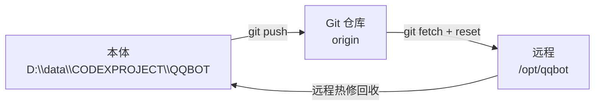

# AGENT.md

## 目标

这个仓库只维护一件事：`核心代码` 在下面三个位置始终一致。

1. 本体：本地工作区 `D:\data\CODEXPROJECT\QQBOT`
2. Git 仓库：`origin = https://github.com/Canstie/QQbot.git`
3. 远程运行机：`root@1.95.180.237:/opt/qqbot`



结论很简单：

- 平时只在`本体`改代码
- `Git 仓库`是唯一真源
- `远程`只负责运行，不保存独有代码

## 只同步什么

下面这些属于`核心代码`，需要三重同步：

- `src/`
- `scripts/`
- `tests/`
- `tools/`
- `static/`
- `bot.py`
- `.python-version`
- `pyproject.toml`
- `uv.lock`
- `README.md`
- `AGENT.md`
- `replies.json`
- `.env.example`

下面这些不属于核心代码，不做三重同步：

- `.env`
- `data/qqbot.sqlite3*`
- `data/menu_images/`
- `data/classics/`
- `logs/`
- `build/`
- `sync-backups/`
- `.pytest_cache/`
- `.ruff_cache/`
- `__pycache__/`

规则：`运行产物、缓存、日志、图片、数据库` 一律不当成同步对象。

## 同步原则

1. 改动先落在本体，不在远程直接改文件。
2. 本体改完先提交到 Git，再从 Git 部署到远程。
3. 如果远程临时热修，必须立刻回收回本体并补 Git 提交。
4. 任何时候发现三处不一致，优先以 Git 当前目标分支为准。

## 日常流程

### 0. Python 与依赖管理

- 项目统一使用 uv 管理环境和依赖，不再使用 `python -m venv` 或 `pip install`。
- Python 版本以 `.python-version` 为准，当前固定为 `3.13.15`。
- 修改 `pyproject.toml` 中的依赖后，必须运行 `uv lock` 并同时提交 `uv.lock`。
- 本机使用 `uv sync` 同步开发环境，使用 `uv run pytest` 运行完整测试。
- 服务器使用 `/usr/local/bin/uv sync --frozen --no-dev`，禁止在服务器重新解析或改写锁文件。
- `qqbot.service` 直接运行 `/opt/qqbot/.venv/bin/python /opt/qqbot/bot.py`；uv 只负责构建环境，不作为 systemd 运行入口。

### 1. 本体 -> Git

在本地完成功能、测试、自检后提交：

```powershell
uv sync
uv run pytest
git add src scripts tests tools static bot.py .python-version pyproject.toml uv.lock README.md AGENT.md replies.json .env.example
git commit -m "你的变更说明"
git push origin HEAD:master
```

如果这次只改了部分文件，也只提交本次实际改动，不要把日志、数据库、缓存带进去。

### 2. Git -> 远程

远程工作目录只对齐 Git，不手工拷文件：

```powershell
ssh root@1.95.180.237 @'
cd /opt/qqbot
git fetch origin
git reset --hard origin/master
/usr/local/bin/uv sync --frozen --no-dev
systemctl restart qqbot.service
systemctl is-active qqbot.service minio.service
'@
```

服务器没有 uv 时，先按官方安装器安装到 `/usr/local/bin`，并安装项目固定的 Python：

```bash
curl -LsSf https://astral.sh/uv/install.sh | env UV_INSTALL_DIR=/usr/local/bin sh
/usr/local/bin/uv python install 3.13.15 --managed-python
```

如果仓库默认分支不是 `master`，把命令中的分支名替换成实际分支。部署完成后必须确认
服务器 `HEAD`、GitHub `master` 和本机待部署提交一致。

### 3. 远程 -> 本体

只有一种情况需要从远程回收：远程已经被人直接改过。

先在远程确认改动，再把补丁带回本体处理，不要让远程长期漂移。

推荐做法：

```powershell
ssh root@1.95.180.237 "cd /opt/qqbot && git status --short && git log --oneline -n 5"
```

如果远程确实有未回收代码：

```powershell
git remote remove qqbot-remote 2>$null
git remote add qqbot-remote root@1.95.180.237:/opt/qqbot
git fetch qqbot-remote
git merge qqbot-remote/master --no-edit
```

回收到本体后，立即重新提交并部署一次，让三处重新对齐。

## 推荐操作顺序

每次发版都按这个顺序，不要跳步：

1. 在本体改代码
2. 运行 `uv sync` 和 `uv run pytest`
3. 提交代码、`.python-version` 和 `uv.lock` 到 Git
4. 远程重置到同一提交并执行 `uv sync --frozen --no-dev`
5. 重启后检查 `qqbot.service`、`minio.service`、Web 端口和 OneBot 连接

## 忽略规则

`.gitignore` 必须持续覆盖这些目录或文件：

- `logs/`
- `build/`
- `sync-backups/`
- `data/qqbot.sqlite3*`
- `data/menu_images/`
- `data/classics/`
- 各类缓存目录

仓库里只保留`可复现代码`和`必要种子数据`，例如 `data/recipes_seed.jsonl`。

## 判断标准

如果一个文件满足下面任一条件，就不应该进入三重同步：

- 运行后自动生成
- 只在本机临时使用
- 可删除后重新生成
- 属于日志、图片、缓存、数据库或备份

如果一个文件删掉后会影响功能源码、测试、脚本、前端页面或部署入口，它才属于核心代码。
